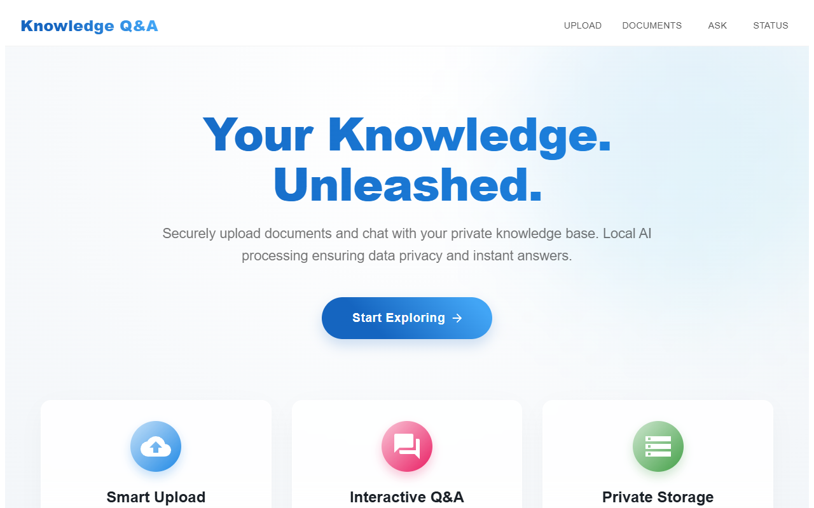
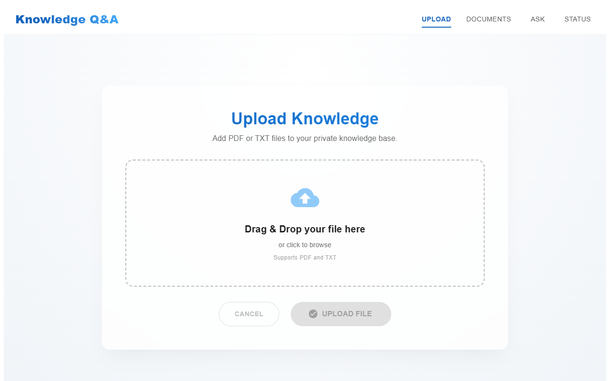
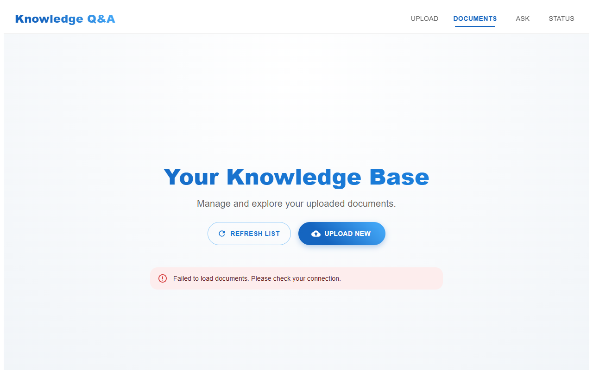
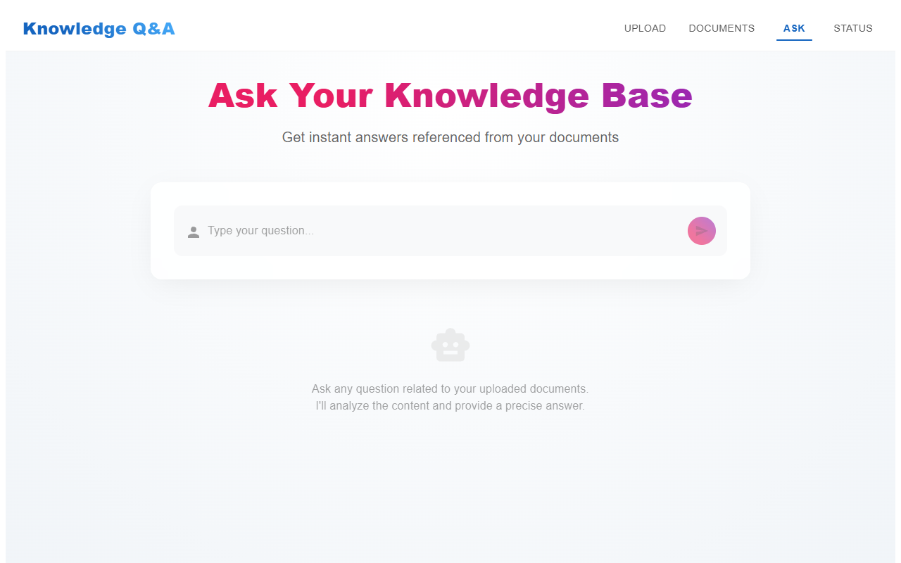

# Personal Knowledge Base (RAG)

A full-stack, Retrieval-Augmented Generation (RAG) application to build your own personal knowledge base.

## Features

- **Ingest Documents**: Upload and process documents (TXT, PDF, etc.) into vector embeddings.
- **RAG Powered Q&A**: Ask questions and get answers grounded in your uploaded documents.
- **AI-Driven**: Uses advanced LLMs (via OpenRouter/Google GenAI) and Weaviate for semantic search.
- **Unified Deployment**: Both frontend and backend are containerized into a single Docker image for easy deployment.

## User Interface

Below are snapshots of the application interface.

### Home & Status


_The landing page of the application._

### Upload Documents


_Interface to upload PDFs and text files for ingestion._

### Knowledge Base (Documents)


_List of all indexed documents in the vector database._

### Q&A Interface


_Chat interface to ask questions against your knowledge base._

---

## Architecture

This project uses a **Monolithic Container** architecture:

- **Frontend**: React + Vite (built and served statically).
- **Backend**: Node.js + Express (API + Static File Serving).
- **Database**: Weaviate Cloud (External Vector DB).

The backend serves the frontend static files, meaning the entire application runs on a single port (default: `5000`).

## Prerequisites

- [Docker Desktop](https://www.docker.com/products/docker-desktop/) installed and running.
- [Node.js](https://nodejs.org/) (v18+) if running locally without Docker.
- A Weaviate Cloud instance (URL & API Key).
- API Keys for Google Generative AI and OpenRouter.

## Quick Start (Docker)

The recommended way to run the application is using Docker.

### 1. Build the Image

```bash
docker build -t personal-knowledge-base .
```

### 2. Run the Container

You need to provide your environment variables at runtime.

**Option A: Pass environment file (Recommended)**
Ensure your `backend/.env` file is populated with the required keys.

```bash
docker run -d -p 5000:5000 --name personal-kb --env-file backend/.env personal-knowledge-base
```

**Option B: Pass individual variables**

```bash
docker run -d -p 5000:5000 \
  -e PORT=5000 \
  -e WEAVIATE_HOST="your_weaviate_host" \
  -e WEAVIATE_API_KEY="your_weaviate_key" \
  -e GOOGLE_API_KEY="your_google_key" \
  -e OPENROUTER_API_KEY="your_openrouter_key" \
  personal-knowledge-base
```

The application will be available at `http://localhost:5000`.

## Local Development (Without Docker)

To develop locally, you need to run the frontend and backend separately.

### Backend Setup

1.  Navigate to `backend`:
    ```bash
    cd backend
    ```
2.  Install dependencies:
    ```bash
    npm install
    ```
3.  Create/Update `.env` file with required keys.
4.  Start server:
    ```bash
    npm run dev
    ```

### Frontend Setup

1.  Navigate to `frontend`:
    ```bash
    cd frontend
    ```
2.  Install dependencies:
    ```bash
    npm install
    ```
3.  Create `.env` file pointing to backend:
    ```
    VITE_API_URL=http://localhost:5000
    ```
4.  Start dev server:
    ```bash
    npm run dev
    ```

## Environment Variables

| Variable             | Description                                                                      |
| :------------------- | :------------------------------------------------------------------------------- |
| `PORT`               | The port the backend server listens on (default: 5000).                          |
| `WEAVIATE_HOST`      | The hostname of your Weaviate instance. (e.g., `cluster-abc.gcp.weaviate.cloud`) |
| `WEAVIATE_API_KEY`   | API Key for authenticating with Weaviate.                                        |
| `GOOGLE_API_KEY`     | API Key for Google Generative AI (Gemini).                                       |
| `OPENROUTER_API_KEY` | API Key for OpenRouter services.                                                 |

## Project Structure

```
/
├── backend/            # Express.js backend source code
│   ├── src/            # Application logic (Controllers, Routes, Services)
│   ├── uploads/        # Directory for temporary file uploads
│   └── package.json
├── frontend/           # React + Vite frontend source code
│   ├── src/            # React components, pages, and hooks
│   └── package.json
├── Dockerfile          # Multi-stage Docker build instruction
├── .dockerignore       # Performance optimization for Docker builds
├── scripts/            # Automation scripts (e.g., screenshots)
└── THINKING.md         # Architectural decisions and approach
```
